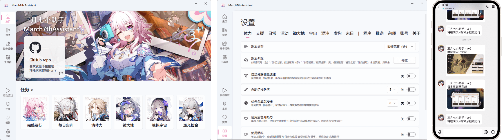

<div align="center">
  <h1 align="center">
    
    <br/>
    March7thAssistant-personal
  </h1>
</div>

<br/>

<div align="center">
🌟 點一下右上角的 Star，Github 首頁就能收到軟體更新通知了。
</div>

<div align="center">
    
</div>

<br/>

<div align="center">

[简体中文](./README.md) | **繁體中文** | [English](./README_EN.md) | [日本語](./README_JA.md) | [한국어](./README_KR.md)

**此文件由 AI 根據簡體中文版翻譯。最後更新：2026-04-24。如有差異，請以簡體中文版為準。**

**遊戲內語言目前僅支援簡體中文。**

快速上手，請訪問：[使用教程](https://m7a.top/#/assets/docs/Tutorial)

遇到問題，請先查看：[FAQ](https://m7a.top/#/assets/docs/FAQ)

</div>

## 功能簡介

- **日常**：清體力、每日實訓、領取獎勵、委託、鋤大地
- **周常**：歷戰餘響、貨幣戰爭、差分宇宙、混沌回憶、虛構敘事、末日幻影
- **雲·星穹鐵道**：支援背景執行、無視窗執行與 Docker 執行
- **抽卡記錄導出**：支援 [UIGF](https://uigf.org/zh/standards/uigf.html) / [SRGF](https://uigf.org/zh/standards/srgf.html) 標準
- **工具箱**：自動對話、解鎖幀率、兌換碼
- 每日實訓等任務的完成情況支援 **訊息推送**
- 任務刷新或體力恢復到指定值後支援 **自動啟動**
- 任務完成後支援 **聲音提示、自動關閉遊戲或關機等**


## 介面展示



## 注意事項

- 個人自用版，不保證穩定性。如需原版（上游）體驗可前往 [moesnow/March7thAssistant](https://github.com/moesnow/March7thAssistant)

## 下載安裝

前往 [Releases](https://github.com/sparklelcm333/March7thAssistant-personal/releases/latest) 下載後解壓，雙擊三月七圖示的 `March7thAssistant.exe` 打開圖形介面。

## 原始碼執行

如果你是完全不懂的小白，請直接使用上面的方式下載安裝，可以不用往下看。

建議使用 Python 3.12 或更高版本。

Windows 下如果透過終端啟動，建議使用系統管理員模式開啟 PowerShell、Windows Terminal 或 CMD；Windows 11 24H2 及以上也可以依照 [Sudo for Windows](https://learn.microsoft.com/zh-cn/windows/advanced-settings/sudo/) 的方式執行。

```cmd
# Installation (using venv is recommended)
git clone https://github.com/sparklelcm333/March7thAssistant-personal
cd March7thAssistant-personal
pip install -r requirements.txt
python main.py

# Update
git pull
```

如果使用 `uv`，建議直接使用專案內建的 `pyproject.toml` 工作流：

```cmd
# Installation (using uv)
git clone https://github.com/sparklelcm333/March7thAssistant-personal
cd March7thAssistant-personal
uv sync

# 啟動圖形介面
uv run python main.py

# 查看命令列說明
uv run python main.py -h

# 執行完整運行
uv run python main.py

# 執行每日實訓
uv run python main.py daily
```

<details>
<summary>開發相關</summary>

如需取得 crop 參數表示的裁切座標，可以使用小助手工具箱中的擷取截圖功能。

</details>

---

如果喜歡本專案，可以微信贊助請作者喝一杯咖啡 ☕

你的支持就是作者開發與維護專案的動力。


---

## 相關專案

March7thAssistant 離不開以下開源專案與執行期依賴的幫助，感謝所有維護者與貢獻者：

- 模擬宇宙自動化 [https://github.com/CHNZYX/Auto_Simulated_Universe](https://github.com/CHNZYX/Auto_Simulated_Universe)：提供模擬宇宙相關能力
- 鋤大地自動化 [https://github.com/linruowuyin/Fhoe-Rail](https://github.com/linruowuyin/Fhoe-Rail)：提供鋤大地相關能力
- OCR 文字識別 [https://github.com/RapidAI/RapidOCR](https://github.com/RapidAI/RapidOCR)：提供遊戲內文字識別能力
- 圖形介面元件庫 [https://github.com/zhiyiYo/PyQt-Fluent-Widgets](https://github.com/zhiyiYo/PyQt-Fluent-Widgets)：提供主要介面元件與互動體驗
- 圖像處理與自動化相關依賴 `OpenCV`、`PyAutoGUI` 等：提供截圖採集、圖像處理與基礎自動化能力
- 推理加速相關依賴 `ONNX Runtime`、`OpenVINO`：為 OCR 和模型推理提供 CPU / GPU 加速支援

此外，`requirements.txt` 中還包含大量底層依賴，這裡不一一列出；同樣感謝這些專案對本專案的支援。

